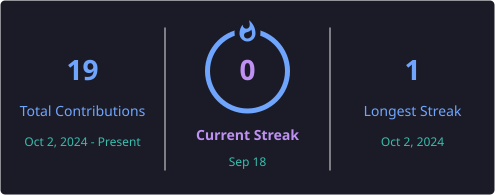
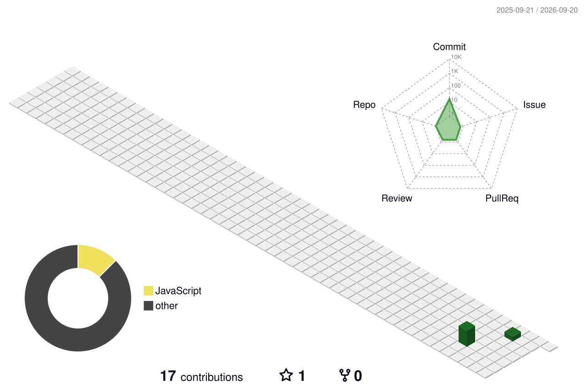

<div align="center">


<br>


<br><br>


</div>

---

<div align="center">

# 👋 Welcome to My GitHub

### 💻 I'm **Syed Muhammad Abdullah**

### 🚀 Front-End Developer

**I enjoy creating clean, responsive and modern web experiences.**

</div>

---

## 🧑‍💻 About Me

I'm **Syed Muhammad Abdullah**, a **Front-End Developer** passionate about creating modern and responsive websites.

My main focus is **Front-End Development**, where I work with:

- 🌐 HTML
- 🎨 CSS
- 🟨 JavaScript
- ⚛️ React
- 🎨 Tailwind CSS
- ▲ Next.js

I also work with **SQL** and continuously improve my skills through learning, practice and building projects.

> 💡 **Learn → Build → Improve → Repeat**

---

# ⚡ My Tech Stack

<div align="center">

### 🌐 Front-End Development


<br><br>

### 🗄️ Database


<br><br>

### 🛠️ Tools


</div>

---

# 🧠 Technologies I Use

<div align="center">

| Technology | Focus |
|:---:|:---|
| 🌐 **HTML** | Web Structure |
| 🎨 **CSS** | Styling & Responsive Layouts |
| 🟨 **JavaScript** | Web Interactivity |
| ⚛️ **React** | Modern User Interfaces |
| 🎨 **Tailwind CSS** | Responsive UI Development |
| ▲ **Next.js** | Modern React Web Development |
| 🗄️ **SQL** | Database |

</div>

---

# 🎨 What I Love Building

<div align="center">

### 💻 Modern Web Interfaces

Clean and attractive user interfaces.

### 📱 Responsive Websites

Web experiences that work across different screen sizes.

### ⚛️ Interactive Experiences

Modern interfaces built with React and JavaScript.

### 🎨 Beautiful UI

Clean layouts, responsive designs and smooth user experiences.

</div>

---

# 📊 GitHub Analytics

<div align="center">





</div>

---

# 🔥 Contribution Streak

<div align="center">



</div>

---

# 🌌 3D Contribution Universe

<div align="center">



</div>

---

# 🐍 Contribution Snake

<div align="center">

<picture>
  <source media="(prefers-color-scheme: dark)" srcset="https://raw.githubusercontent.com/SyedAbdullah0318/SyedAbdullah0318/output/github-contribution-grid-snake-dark.svg">
  <source media="(prefers-color-scheme: light)" srcset="https://raw.githubusercontent.com/SyedAbdullah0318/SyedAbdullah0318/output/github-contribution-grid-snake.svg">
  
</picture>

</div>

---

# 🌟 My Front-End Journey

<div align="center">

```text
                         💻 FRONT-END DEVELOPMENT
                                   │
                                   ▼
                            ┌─────────────┐
                            │    HTML     │
                            └──────┬──────┘
                                   │
                                   ▼
                            ┌─────────────┐
                            │  CSS + JS   │
                            └──────┬──────┘
                                   │
                                   ▼
                            ┌─────────────┐
                            │    React    │
                            └──────┬──────┘
                                   │
                                   ▼
                       ┌─────────────────────┐
                       │    Tailwind CSS     │
                       └──────────┬──────────┘
                                  │
                                  ▼
                       ┌─────────────────────┐
                       │      Next.js        │
                       └──────────┬──────────┘
                                  │
                                  ▼
                            ┌─────────────┐
                            │     SQL     │
                            └─────────────┘
